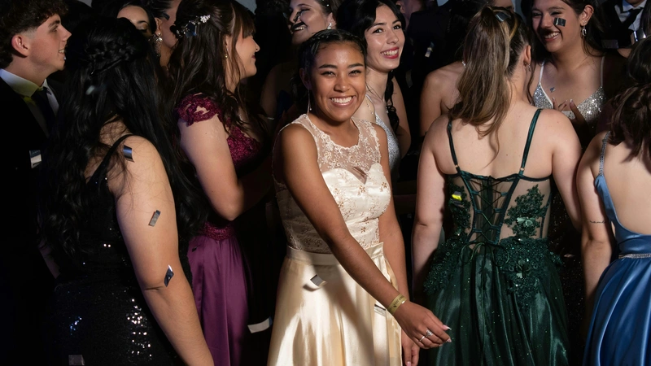

# rescale-images  

This area contains scripts to **automatically crop, resize, and convert** high-resolution stock volunteer images to a standardized **800x450 resolution**. The processed images are saved as [WEBP](https://datatracker.ietf.org/doc/rfc9649/) files for optimal compression and quality.

## How It Works  

- Place original images in the [`stock-images`](stock-images) folder.
- Processed images will be saved in [`scaled-stock-images`](scaled-stock-images).
- Subfolders in [`stock-images`](stock-images) are processed **recursively**, and the folder structure is preserved in the output.

> ⚠️ Files in [`scaled-stock-images`](scaled-stock-images) will be **overwritten without warning**, but **existing files are not deleted**. To avoid leftover or stale files, manually delete the [`scaled-stock-images`](scaled-stock-images) folder before re-running the script.

## Usage  

### Running with Python  

1. Ensure you have Python installed.
2. Install the required dependencies:

    ```bash
    pip install -r requirements.txt
    ```

3. Run the script:

    ```bash
    python rescale-images.py
    ```

### Running with Docker  

Use the included [launch.sh](launch.sh) script to run the process in a containerized environment:

```bash
./launch.sh
```

This will:

- Start a Python container
- Install dependencies
- Process all images in [stock-images](stock-images)

Alternatively, run the process directly using Docker:

```bash
docker run --rm \
    -v /"$PWD":/usr/src/app \
    -w //usr/src/app \
    python \
    sh -c "pip install -r requirements.txt && python rescale-images.py"
```

## Notes  

- All input images are **automatically clipped to a 16:9 aspect ratio**, centered on the image.
  - If the image is too tall, it is cropped equally from the top and bottom.
  - If too wide, it is cropped equally from the sides.
- After cropping, the image is resized to **800x450 pixels**.
- The final image is saved as a [WEBP](https://datatracker.ietf.org/doc/rfc9649/) file in the [`scaled-stock-images`](scaled-stock-images) folder, with the original folder structure retained.
- The script works best when subjects are **centered** in the original images.

> ⚠️ If your original image is far from a 16:9 aspect ratio and the subject isn't centered, results may be poor. In those cases, manual cropping before running the script is recommended.

## Example

### Original Image

File path: [stock-images/example/event/pexels-alejandro-peralta-33843739-19595298.jpg](stock-images/example/event/pexels-alejandro-peralta-33843739-19595298.jpg)


### Processed Image

File path: [scaled-stock-images/example/event/pexels-alejandro-peralta-33843739-19595298.webp](scaled-stock-images/example/event/pexels-alejandro-peralta-33843739-19595298.webp)


